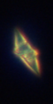
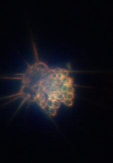
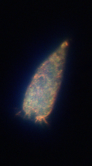
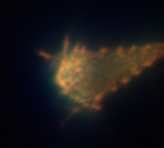
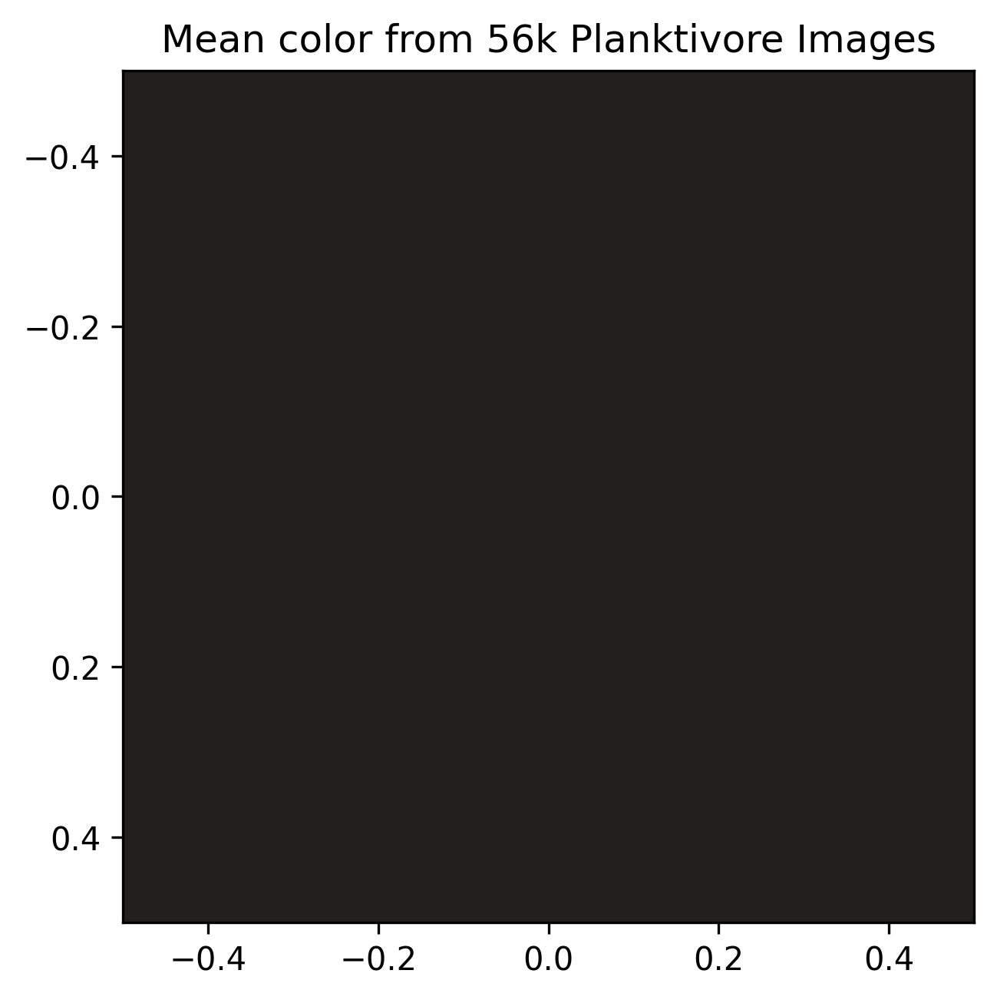
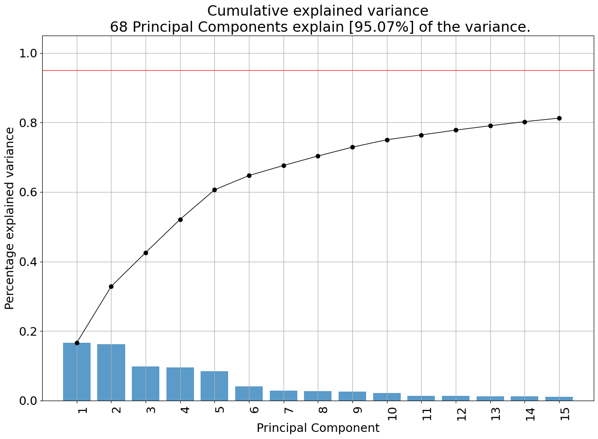

# Planktivore Image Analysis #

Images collected from a Synchrom LRAUV campaign equipped with the Planktivore imaging instrument.

Dataset contains 70k+ images

---
## Content ##

- `planktivore_unzip_pngs.py`: Unzips .zip achives to remove the .png, jpg, or image masks.
- `planktivore_mean_color.ipynb`: Analyzes the mean color for the datasets.
- `planktivore_train_clusters.py`: This script will generate and save clusters based on the conditions set in the `main()` function
- `planktivore_custerImage.ipynb`: Using the ClusterImage package to analyze the different unsupervised clustering methods and feature extractions on the images

## Results ##
__Mean Color__  
(R=0.1350966  G=0.12162398 B=0.12369811)  
  

